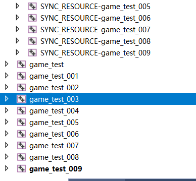

 

老样子,先装个py2.7
运行目录下的py,
再找个目录,对着空白处鼠标右键<此处打开powershell>
cocos new game_test -l cpp
新建项目后,进入proj.win32再调出 powershell 
输入cmake .. -G "Visual Studio 15 2017" -A win32或其它IDE版本就创建好了,然后用VS打开,

 

## 📄 License

MIT